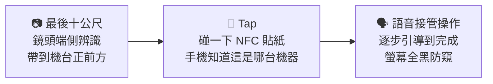

# TapAble — 你的手機，接管機台

> **機台操作的手機接管中介層。** 視障者用自己的手機，操作面前那台沒有無障礙功能的觸控機台
> —— 機台零硬體改造。
>
> BUILDMODE GEN-AI HACKATHON 2026 · Track 05「AI for Taiwan / Social Impact」參賽作品

## 🎬 兩分鐘看懂

- 評選影片：【交件前補上 YouTube 連結】
- **機台操作 demo**（手機開）：https://a96020183.github.io/taska-voice-demo/
- **街道導引 demo**（手機開，允許相機）：https://a96020183.github.io/taska-voice-demo/vision/
  —— 用另一台裝置開同網址加 `?marker=1` 當模擬機台

## 為什麼做這個

- 全台超過 **2.8 萬台 ATM，僅約 3%** 提供視障語音服務（公視新聞）
- 視障團體半年實測，**超過 1/3** 的語音提款機無法順利操作（身心障礙聯盟）
- 校園列印機、醫院批價機、點餐機 —— **連那 3% 都沒有**。受訪視障者稱純觸控點餐機為
  「完全的障礙場域」

我們訪談了三位視障者。一位視障學校的點字老師說，他要的只是——

> **「想去領錢，就去領錢。」** 不用配合任何人的時間。

改造機台太慢也太貴（一台一台改）。TapAble 反過來：**機台不動，手機接管。**

## 一段旅程、三個接力

1. **最後十公尺**（`vision/`）：後鏡頭即時物件辨識（全程端側推論，影像不上傳），
   把使用者帶到機台正前方。定位是「最後十公尺」的臨門引導，不是導航系統。
2. **Tap 交棒**：碰一下機台旁的 NFC 貼紙，手機立刻知道面前是哪一台機器、載入它的操作知識。
3. **語音接管**（`index.html`）：手機以對話式流程逐步引導 —— 包含只寫在機台貼紙上、
   視障者永遠讀不到的在地知識（「這台機器不收一元硬幣」）。全程螢幕全黑，旁人無法窺視。

## 這裡面什麼是真的（誠實揭露）

- ✅ **真實機台、戴眼罩實測**：我們在校園文件列印機前做了多輪眼罩實測（實測手冊見
  [docs/field-test-manual.md](docs/field-test-manual.md)），語音腳本的每一句距離都來自實地測量
- ✅ **真實視障者訪談**：三位視障者（含視障學校點字老師、助聽器使用者），
  方案滿意度平均 4.67/5；「三步原則」「可中斷語音」「黑屏操作」皆為訪談產出的設計要求
- ✅ **真端側推論**：vision 段為 SSDLite-MobileNetV2（TensorFlow.js）真實模型輸出，
  機台確認輔以 QR 視覺標記；技術細節與限制見 [vision/README.md](vision/README.md)
- ⚠️ **機台畫面為模擬**：真機的款項履約需要機台擁有者（銀行/醫院）開放介接，
  這是商務與法規工程，不是三天做得完的事 —— 本作品呈現的是**不需任何機台配合、
  現在就能落地的語音導引層**；履約層為第二年路線
- ⚠️ 語音辨識使用瀏覽器內建 Web Speech API；LLM 對話意圖層開發中（見 Roadmap）

## 執行方式

不用裝任何東西：上面兩個 GitHub Pages 網址手機直接開。

本機執行：clone 後用任何靜態伺服器（如 `python -m http.server`）開 `index.html` 與
`vision/index.html`（相機與語音需 HTTPS 或 localhost）。無後端、無資料庫、零外部 API 呼叫。

## 既有資源與第三方揭露

**時間軸**：語音引導原型（操作段前身）始於 2026-08-28，為本團隊視障田野測試工具；
模擬機台完整對話流程（V2）與街道導引段（vision）為賽期間（9/4–9/6）開發。
視障者訪談與機台田野調查為本團隊賽前既有研究。

| 元件 | 版本 | 授權 |
|---|---|---|
| TensorFlow.js | 4.22.0 | Apache-2.0 |
| @tensorflow-models/coco-ssd（SSDLite-MobileNetV2，COCO 預訓練） | 2.2.3 | Apache-2.0 |
| MobileNet v1 0.25（外觀比對嵌入） | tfjs-models | Apache-2.0 |
| jsQR | 1.4.0 | Apache-2.0 |
| qrcode-generator | 1.4.4 | MIT |
| Web Speech API（TTS／ASR） | 瀏覽器內建 | — |

模型與函式庫皆隨頁面自帶，執行期零外部網路請求；影像僅於裝置端記憶體即時處理，不儲存、不上傳。

## 參考來源

**問題與市場數據**
- 全台 ATM 逾 2.8 萬台、僅 22 家銀行 808 據點提供視障語音（約 3%）— 公視新聞《ATM 提供視障語音服務 全台僅占 3%》
- 逾 1/3 語音提款機無法順利操作、耳機孔損壞與點字磨損 — 中華民國身心障礙聯盟拜會金管會銀行局會議紀錄與實測
- ATM 密度每 10 萬成年人約 167 台（全球平均 52.3）— 金管會普惠金融衡量指標
- 本國銀行 39 家 — 中央銀行金融機構一覽表（民國 115 年 5 月）

**法規與合規**
- 金管會《銀行業金融友善服務準則》、「公平待客原則」評核機制
- 金管會《金融機構作業委託他人處理內部作業制度及程序辦法》第十四條（受託方資安盡職調查）
- 《身心障礙者權益保障法》、聯合國《身心障礙者權利公約》第 9 條；歐盟 EAA（2025/6/28 起）；美國 ADA §707

**技術與市場前例**
- LINE Touch（2026）：被動式 NFC 標籤喚起輕量應用，免瞄準、防竄改 — LINE 官方產品頁
- 跨行 QR 無卡提款逾 2 萬台 ATM — 永豐銀行新聞稿（2025/3/6）；台新 ATM NFC 感應帶入提款序號（2022 前）— 台新官方公告
- 飛捷科技（全球前三大 POS 廠）— 《天下雜誌》

**無障礙與互動規範**
- W3C WCAG 2.2 AA、WAI-ARIA 1.2（aria-live 狀態通知，相容 VoiceOver／TalkBack）
- 定向行動訓練之時鐘方位（9–3 點鐘）自我中心空間編碼；單目視覺深度估算不適定性 → 本作品僅輸出距離級別、不輸出公尺數

**第三方元件**：見上方「既有資源與第三方揭露」表。

## Roadmap

- **語音導引層（現在）**：本 repo —— 不需任何機台配合，貼一張貼紙就能上線
- **LLM 對話意圖層（進行中）**：自然語言「我要印成績單」→ 結構化操作意圖 → 動態引導
- **機台履約層（第二年）**：與機台擁有者介接，手機端直接完成付款與取件
- **無障礙覆蓋圖層（第三年）**：以空間資料決定「下一張貼紙貼哪裡」——
  原型已可展示：[3S 無障礙空間資訊 demo](https://ken-chui.vercel.app/yao-3s-demo/)

## 團隊

**ChatKTV** —— 隊長：徐浩華｜隊員：林亭汝、劉芯妤、范振恩、洪聖崴

## 授權

[MIT](LICENSE)
