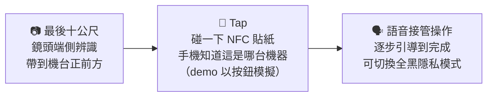

# TapAble — 你的手機，接管機台

> **機台操作的手機接管中介層。** 視障者用自己的手機，操作面前那台沒有無障礙功能的觸控機台
> —— 機台零硬體改造。
>
> BUILDMODE GEN-AI HACKATHON 2026 · Track 05「AI for Taiwan / Social Impact」參賽作品

## ⏱ 評審 60 秒試玩

1. 手機或電腦開 **https://a96020183.github.io/tapable_sep/?machine=campus-document-kiosk&demo=1** → 按「開始操作」，語音會自動開始（畫面下方字幕列同步顯示它說了什麼、聽到什麼）
2. 在「選擇文件」「份數」「確認申請」任一步按 **🎤 用語音選擇**，說「在學證明兩份」或「確認」→ 它會覆誦、你按確認才執行（沒麥克風就直接點選，流程一樣）
3. 付款步驟按 **「Demo：模擬機台收款完成」** → 列印 → 完成頁「文件已印出」。想看投影版加 `&stage=1`；想看鏡頭導引開 `/vision/`（需手機相機）

&nbsp;&nbsp;

## 🎬 兩分鐘看懂

- **Demo 入口頁（一個網址看全部）**：https://a96020183.github.io/tapable_sep/start/
- **機台操作 demo**（手機或電腦開，模擬付款模式可走完全流程）：https://a96020183.github.io/tapable_sep/?machine=campus-document-kiosk&demo=1
- **街道導引 demo**（手機開，允許相機）：https://a96020183.github.io/tapable_sep/vision/
  —— 用另一台裝置開同網址加 `?marker=1` 當模擬機台

## 為什麼做這個

- 全台超過 **2.8 萬台 ATM，僅約 3%** 提供視障語音服務（公視新聞）
- 視障團體半年實測，**超過 1/3** 的語音提款機無法順利操作（身心障礙聯盟）
- 校園列印機、醫院批價機、點餐機 —— **連那 3% 都沒有**。受訪視障者稱純觸控點餐機為
  「完全的障礙場域」

我們訪談了三位視障者。一位視障學校的點字老師說，他要的只是——

> **「想去領錢，就去領錢。」** 不用配合任何人的時間。

改造機台太慢也太貴（一台一台改）。TapAble 反過來：**機台不動，手機接管。**

### 為什麼「改機台」這條路走不通

業界過去的答案是幫 ATM 加點字鍵盤和 3.5mm 耳機孔。實際成效：

- **覆蓋率只有約 3%**：逾 2.8 萬台 ATM 裡，只有 22 家銀行、808 個據點有語音服務 —— 對視障者而言 97% 的機台等於不存在
- **裝了的還有約 1/3 壞掉**：視障團體半年實測，常見耳機孔接觸不良、點字標示過平或貼反、標示掉漆 —— 全是物理耗損，要逐台派人巡檢
- **手機早就沒有耳機孔了**：視障者日常戴的是藍牙耳機，要用傳統語音 ATM 等於隨身帶兩套耳機
- **覆蓋成本與維護成本隨機台數線性上升** —— 不是企業不願投入，是硬體改造的經濟結構本身不成立

另一頭，企業正承受**合規壓力**（金管會把金融友善服務列入公平待客評鑑，影響新業務核准），但為合規在新機台強行開模保留實體按鍵與插孔，動輒是數億元資本支出。
**「想合規、不想花大錢換硬體」這個死結，就是 TapAble 要解的。** 純軟體的邊際成本趨近於零，一次雲端更新修復所有據點。

### 障礙在「定位與回饋」，不在「輸入」—— 五個實際斷點

實地檢視後我們修正了原始假設：很多機台的身分驗證可以用感應卡完成，不需要視覺。真正卡住視障者的是這五個環節：

| 斷點 | 視障者遇到的問題 | TapAble 的對應 |
|---|---|---|
| ① 找到機台 | 不知機台在建物何處、朝哪個方向 | 鏡頭端側辨識帶到機台前（本次作品）；藍牙接近通知（下一階段）|
| ② 找到操作區 | 摸不到感應區或按鍵在螢幕哪一側 | NFC 貼紙加實體凸紋，用觸覺定位 |
| ③ 確認是哪一台 | 多台並排時分不出正對哪一台 | NFC 碰到哪張貼紙，就是哪一台 |
| ④ 確認操作成功 | 螢幕沒語音，不知機器有沒有收到指令 | 手機震動（依裝置支援）＋語音即時回報狀態 |
| ⑤ 取件 | 不知已完成、找不到出鈔口／出紙口 | 語音引導出件位置並確認完成 |

**五個斷點裡有四個（①②③⑤）只需要語音導引層就能解 —— 它不讀、不寫、不控制機台任何資料，不需要任何 API。**
這就是為什麼本次作品先把導引層做出來：不用等任何機構點頭，貼一張貼紙就能上線。

## 為什麼是手機？—— 因為手機＋耳機早就是視障者的日常

很多人第一反應是「視障者怎麼用手機？」。事實正好相反，這是我們訪談三位視障者得到最一致的答案：

- **手機是他們的「數位盲杖」**：受訪者形容「生活幾乎都靠手機」，智慧型手機是視障者最信任、最熟悉的工具，
  也是少數能自己掌控語速、音量的「安全受控環境」。
- **語音操作是社群標配，不是新功能**：iPhone 的 VoiceOver、Android 的 TalkBack 內建多年；受訪的視障學校老師
  習慣 **2 倍速以上**聽讀，「聽兩個字就要能跳轉」。
- **單指滑動選項、雙擊確認**就是他們每天在用的原生手勢 —— TapAble 直接沿用這套**既有肌肉記憶，零學習成本**。
- **耳機讓操作變私密**：語音走耳機，旁人聽不到帳戶與金額；受訪者中有助聽器使用者無法插實體耳機孔，
  所以支援藍牙耳機是必要條件，不是選配。

換句話說：**我們沒有要視障者學新工具，而是把「那台不會說話的機台」搬進他們早就會用的手機裡。**
機台不動，手機接管 —— 這就是零學習成本、零硬體改造的由來。

## 一段旅程、三個接力

1. **最後十公尺**（`vision/`）：後鏡頭即時物件辨識（全程端側推論，影像不上傳），
   把使用者帶到機台正前方。定位是「最後十公尺」的臨門引導，不是導航系統。
2. **Tap 交棒**：碰一下機台旁的 NFC 貼紙，手機立刻知道面前是哪一台機器、載入它的操作知識
   （本次 demo 以按鈕代替碰觸，Web NFC 尚未實作；見下方誠實揭露）。
3. **語音接管**（`index.html`）：手機以對話式流程逐步引導 —— 包含只寫在機台貼紙上、
   視障者永遠讀不到的在地知識（「這台機器不收一元硬幣」）。可一鍵切換全黑隱私模式（語音照常），旁人無法窺視。

## 這裡面什麼是真的（誠實揭露）

- ✅ **真實機台、戴眼罩實測**：我們在校園文件列印機前做了多輪眼罩實測（實測手冊見
  [docs/field-test-protocol.md](docs/field-test-protocol.md)，機台 12 畫面流程規格見 [docs/kiosk-flow.md](docs/kiosk-flow.md)）。
  早期曾設計以公分為單位的實體定位引導，因量測未完成蒐集，**已自作品移除**；本作品以流程與方位引導為主，不呈現任何未經量測的距離
- ✅ **真實視障者訪談**：三位視障者（含視障學校點字老師、助聽器使用者），
  方案滿意度平均 4.67/5；「三步原則」「可中斷語音」「黑屏操作」皆為訪談產出的設計要求
- ✅ **真端側推論**：vision 段為 SSDLite-MobileNetV2（TensorFlow.js）真實模型輸出，
  機台確認輔以 QR 視覺標記；技術細節與限制見 [vision/README.md](vision/README.md)
- ⚠️ **機台畫面為模擬**：真機的款項履約需要機台擁有者（銀行/醫院）開放介接，
  這是商務與法規工程，不是三天做得完的事 —— 本作品呈現的是**不需任何機台配合、
  現在就能落地的語音導引層**；履約層為下一階段路線
- ✅ **語音輸入覆蓋選件、份數、確認、學年期四個步驟**（瀏覽器內建 Web Speech API，端側；辨識後語音覆誦、按確認才執行，任何步驟皆保留點擊與滑動）
- ✅ **demo 一開始操作就有語音**（可隨時關閉）；**隱私模式（黑屏）為可選切換、預設畫面可見；開啟後語音照常，僅密碼／身分步驟不朗讀**
- ⚠️ **NFC 碰觸交棒為模擬**：demo 以按鈕代替碰觸（vision 段「已抵達」後按鈕導向操作頁），Web NFC（NDEFReader）尚未實作
- ✅ **語音字幕列**：畫面上方同步顯示 demo 目前說出的那句話與語音辨識聽到的逐字稿（身分步驟顯示為靜音），旁觀者也能跟上流程
- ⚠️ **震動＋音效雙重回饋**（訪談產出的「確認操作成功」需求）：每個步驟切換短震，付款成功／列印完成／完成加提示音與較長震動，錯誤為低音；震動以 `navigator.vibrate` 實作、iOS Safari 不支援時只有語音，音效需在第一次點擊後才會啟用
- ⚠️ **LLM 意圖解析為選用**：在頁面設定貼入自備的 OpenAI 相容 API key（僅存本機、不進本 repo）即啟用「一句話 → 結構化意圖」；無 key 時自動退回關鍵字比對，兩者在畫面上會明示。本 repo 不含任何 key。

## 實測情境：從電梯口到印出文件，有沒有 TapAble 差在哪

我們在校園行政大樓做了整段流程的戴眼罩實測（受測者為明眼組員蒙眼模擬，非視障者；視障者的真實需求另以三位訪談驗證）。任務：從一樓搭電梯到五樓，自己印出在學證明。

**沒有任何輔助時** —— 出電梯就卡住。白手杖只探得到腳邊約一公尺，走廊動線和機台方位完全沒概念，只能沿著牆慢慢敲、慢慢摸。好不容易摸到文件機前，整面都是平滑的觸控螢幕，沒有任何實體按鍵或凸點；手在螢幕上反覆盲摸，不知道畫面長什麼樣、按鈕在哪，旁邊有人經過時壓力更大。**最後沒辦法自己印，只能站在那裡等人幫忙。**

**開啟 TapAble 後** —— 手機掛在胸前，雙手留給手杖和平衡。一出電梯，胸前鏡頭在手機上即時辨識，語音提示前方路徑暢通、機台在哪個方向，步伐明顯變快、不怕撞到東西。接近機台時系統提示已抵達（demo 以視覺標記確認），並口述感應貼紙的位置。手機往貼紙一碰 NFC（demo 以按鈕模擬碰觸），相機立刻關閉（不耗電、不會拍到別人的個資），手機跳出這台機器的操作介面；用平常就習慣的滑動與語音報讀選「在學證明」、確認，再依語音引導完成機台上的實體步驟，文件印出來。

差別不在「多了一個功能」，而在**能不能獨立完成**。這正是我們核心指標「獨立完成率」要量的東西，也是三位受訪視障者說的那句話 —— 「想去領錢，就去領錢」。

## 執行方式

不用裝任何東西：上面兩個 GitHub Pages 網址手機直接開。

本機執行：clone 後用任何靜態伺服器（如 `python -m http.server`）開 `index.html` 與
`vision/index.html`（相機與語音需 HTTPS 或 localhost）。無後端、無資料庫；預設零外部 API 呼叫（僅在使用者自行貼入 LLM key 時才會呼叫該服務）。

投影／簡報用大字模式加 `?stage=1`，畫面會包在手機外框（含示意狀態列）中呈現；視窗寬度 ≥900px 時也會自動套用外框。點畫面任一處空白（按鈕、輸入欄與對話框除外）可立即略過目前語音。
模擬機台事件與 12 畫面進度收在頁尾「更多」面板，預設收合，不影響主流程。

## 既有資源與第三方揭露

**時間軸**：語音引導原型（操作段前身）始於 2026-08-28，為本團隊視障田野測試工具；
模擬機台完整對話流程（V2）與街道導引段（vision）為賽期間（9/4–9/6）開發。
視障者訪談與機台田野調查為本團隊賽前既有研究。

| 元件 | 版本 | 授權 |
|---|---|---|
| TensorFlow.js | 4.22.0 | Apache-2.0 |
| @tensorflow-models/coco-ssd（SSDLite-MobileNetV2，COCO 預訓練） | 2.2.3 | Apache-2.0 |
| MobileNet v1 0.25（外觀比對嵌入） | tfjs-models | Apache-2.0 |
| jsQR | 1.4.0 | Apache-2.0 |
| qrcode-generator | 1.4.4 | MIT |
| Web Speech API（TTS／ASR） | 瀏覽器內建 | — |

模型與函式庫皆隨頁面自帶，預設執行期零外部網路請求（選用的 LLM 意圖解析除外，需使用者自備 key）；影像僅於裝置端記憶體即時處理，不儲存、不上傳。
完整第三方授權與 NOTICE 見 [THIRD_PARTY_LICENSES.md](THIRD_PARTY_LICENSES.md)；`kiosk-refs.json` 產生流程見 `tools/build-kiosk-refs.js`；回歸測試見 [tests/README.md](tests/README.md)。

**3S 無障礙空間資訊 demo**（Roadmap 連結）為本團隊成員先前專案之原型，開發成員與本次隊伍部分不同，屬既有資源，非本次賽期產出。

## 參考來源

**問題與市場數據**
- 全台 ATM 逾 2.8 萬台、僅 22 家銀行 808 據點提供視障語音（約 3%）— 公視新聞《ATM 提供視障語音服務 全台僅占 3%》
- 逾 1/3 語音提款機無法順利操作、耳機孔損壞與點字磨損 — 中華民國身心障礙聯盟拜會金管會銀行局會議紀錄與實測
- ATM 密度每 10 萬成年人約 167 台（全球平均 52.3）— 金管會普惠金融衡量指標
- 本國銀行 39 家 — 中央銀行金融機構一覽表（民國 115 年 5 月）

**法規與合規**
- 金管會《銀行業金融友善服務準則》、「公平待客原則」評核機制
- 金管會《金融機構作業委託他人處理內部作業制度及程序辦法》第十四條（受託方資安盡職調查）
- 《身心障礙者權益保障法》、聯合國《身心障礙者權利公約》第 9 條；歐盟 EAA（2025/6/28 起）；美國 ADA §707

**技術與市場前例**
- LINE Touch（2026）：被動式 NFC 標籤喚起輕量應用，免瞄準、防竄改 — LINE 官方產品頁
- 跨行 QR 無卡提款逾 2 萬台 ATM — 永豐銀行新聞稿（2025/3/6）；台新 ATM NFC 感應帶入提款序號（2022 前）— 台新官方公告
- 飛捷科技（全球前三大 POS 廠）— 《天下雜誌》

**無障礙與互動規範**
- W3C WCAG 2.2 AA、WAI-ARIA 1.2（aria-live 狀態通知，相容 VoiceOver／TalkBack）
- 定向行動訓練之時鐘方位（9–3 點鐘）自我中心空間編碼；單目視覺深度估算不適定性 → 本作品僅輸出距離級別、不輸出公尺數

**第三方元件**：見上方「既有資源與第三方揭露」表。

## 商業模式：誰付錢

**視障者永遠免費。付費的是機台擁有者 —— 銀行、醫院、機台營運方。**

- **最精準的第一批客戶**：已經提供語音 ATM 服務的 22 家銀行。理由有三：已編列無障礙預算（採購意願被驗證）、正承受既有設備約 1/3 失效的維護壓力、已被金管會公平待客評鑑列管而有立即導入的合規動機。
- **雙軌導入**：金融場域以 SDK 打包進銀行既有官方 App（IT 不動核心系統）；醫療、零售等低頻場域改走**免下載的 LINE 輕量網頁**（NFC 貼紙一碰即開 —— LINE Touch 在台灣已把這個互動商業化，首發於連鎖手搖飲點餐）。
- **製造端通路（下一階段）**：台灣是全球自助服務硬體重鎮（飛捷為全球前三大 POS 廠），與製造商合作把無障礙模組以出廠預載隨機台出貨，一次整合覆蓋全部出貨量；「無障礙 ready」也是公共採購標案日益要求的規格。
- **影響力怎麼量**：核心指標是**獨立完成率**（未經他人協助即完成任務的比例），以去識別化事件節點建立操作漏斗；純軟體方案同時省下機台開模、改裝與汰換的電子廢棄物與碳排，可直接餵入合作機構的永續揭露。

終局目標：讓「無障礙」從企業的善意投入，變成經濟上理性的選擇 —— 導入成本從數億元硬體資本支出，降為可控的年度軟體費用。

## Roadmap

- **語音導引層（本次作品）**：本 repo —— 不需任何機台配合，貼一張貼紙就能上線
- **LLM 意圖解析（選用，已實作；預設關鍵字比對）**：自然語言「我要印成績單」→ 結構化操作意圖 → 動態引導
- **機台履約層（下一階段，需銀行／醫院合作；架構已設計、尚未實作）**：ATM 等金流情境的安全設計 ——
  手機端完成身分與金額確認後，指令經端對端加密直傳**金融機構自有雲端**，由機構雲端**單向**對實體機台下達吐鈔／列印；
  交易資料**完全不經過眼前那台機台**，語音導引層也**不讀寫機台任何資料、不持有後端權限**，兩條管線在程序與記憶體上隔離。
  介接的是銀行**既有的無卡提款機制**（需逐家合作與資安認證，屬商務與法規工程，非純技術問題）——這正是為什麼本次作品先落地不需任何 API 的導引層，履約層隨首家合作機構啟動。
- **無障礙覆蓋圖層（長期）**：以空間資料決定「下一張貼紙貼哪裡」——
  原型已可展示：[3S 無障礙空間資訊 demo](https://ken-chui.vercel.app/yao-3s-demo/)

## 團隊

**ChatKTV** —— 隊長：徐浩華｜隊員：林亭汝、劉芯妤、范振恩、洪聖崴

## 授權

[MIT](LICENSE)
