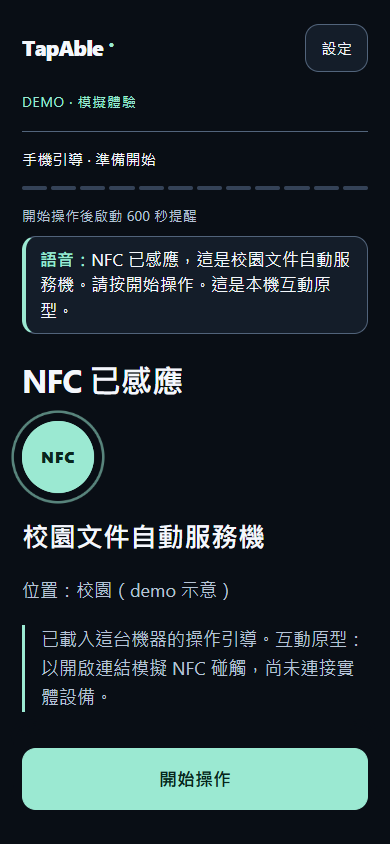
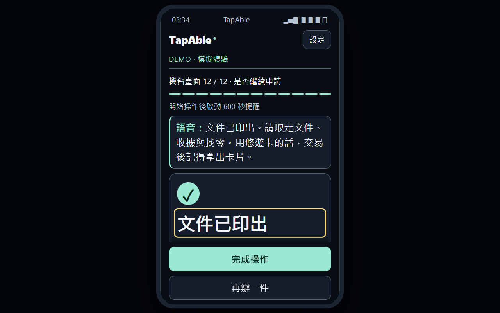
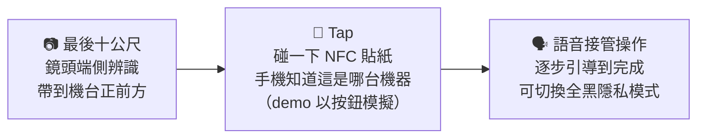
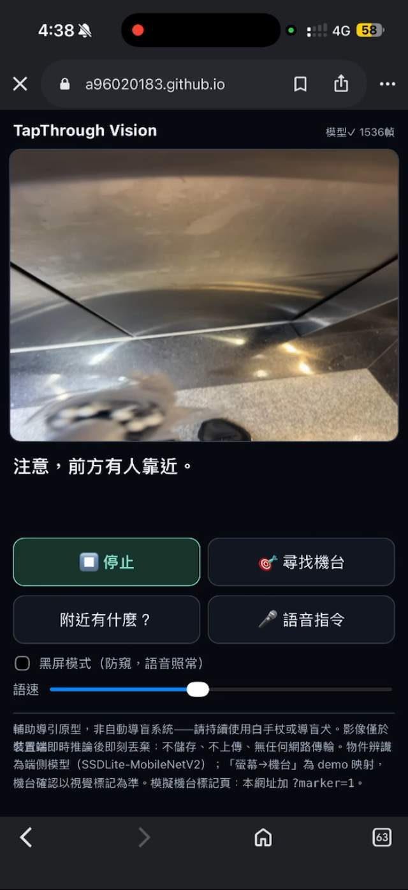

# TapAble — 你的手機，接管機台

> **機台操作的手機接管中介層。** 視障者用自己的手機，操作面前那台沒有無障礙功能的觸控機台
> —— 機台零硬體改造。
>
> BUILDMODE GEN-AI HACKATHON 2026 · Track 05「AI for Taiwan / Social Impact」參賽作品

## ⏱ 評審 60 秒試玩

1. 手機或電腦開 **https://a96020183.github.io/tapable_sep/?machine=campus-document-kiosk&demo=1** → 按「開始操作」，語音會自動開始（畫面上方字幕列同步顯示它說了什麼、聽到什麼）
2. 在「選擇文件」「份數」「確認申請」任一步按 **🎤 用語音選擇**，說「在學證明兩份」或「確認」→ 它會覆誦、你按確認才執行（沒麥克風就直接點選，流程一樣）
3. 付款步驟按 **「Demo：模擬機台收款完成」** → 列印 → 完成頁「文件已印出」。想看投影版加 `&stage=1`；想看鏡頭導引開 `/vision/`（需手機相機）

&nbsp;&nbsp;

## 📊 評分對照：四項標準的證據在哪

| 評分項 | 本作品的證據 | 位置 |
|---|---|---|
| **問題定義與影響力 35%** | 視障語音 ATM 八年從 808 據點做到 7,881 台（金管會 2025/10/02 新聞稿）——監理有效但逐台派工、仍不足四分之一，且這條慢車道只存在於金融場域；逾 1/3 語音機因物理耗損失效（身心障礙聯盟）；五個操作斷點對照；三位視障者訪談（滿意度 4.67/5）與「想去領錢就去領錢」；電梯口到印出文件的實測情境；銀行／醫院付費、視障者永久免費的商業模式與合規動機 | 「為什麼做這個」「為什麼是手機」「五個實際斷點」「實測情境」「商業模式」「參考來源」|
| **技術實作 30%** | 端側電腦視覺三層（COCO 偵測 → 機台外觀 kNN 比對 → 視覺標記確認）、事件引擎（優先序、逼近偵測、多人去重）；語音輸入四步驟＋覆誦確認；**規則式＋大型語言模型雙層意圖解析**（預設走自架代理，斷網自動退回裝置端規則式，三道白名單驗證）；Service Worker 離線（18MB 模型預快取）；黑屏防窺＋雙重回饋；Playwright 回歸 80＋29 項、意圖解析單元 85 項（直接測 index.html 內出貨的解析器）、vision 五支 31 項；**axe-core WCAG 2.1 A/AA 18 個畫面 0 違規**、純鍵盤操作 6 項 | `index.html`、`vision/`、`server/vercel`、`tests/`、「這裡面什麼是真的」|
| **成果展示 20%** | 一個入口頁看全部（含 60 秒語音導覽與逐字稿）；60 秒試玩導引；手機與投影兩張截圖；`?stage=1` 手機外框投影模式；入口頁 60 秒語音導覽（附逐字稿）| `start/`、本頁上方 |
| **開源品質 15%** | MIT；第三方授權全文與 NOTICE；`tests/README` 一行指令可重現（含無障礙自動檢測 `tests/a11y/`）；`tools/build-kiosk-refs.js` 產生流程；`docs/kiosk-flow.md`（去識別實地流程）、`docs/field-test-protocol.md`（實測方法與限制）；未實作項目逐條誠實標示 | `LICENSE`、`THIRD_PARTY_LICENSES.md`、`tests/`、`tools/`、`docs/` |

## 🎬 兩分鐘看懂

- **Demo 入口頁（一個網址看全部）**：https://a96020183.github.io/tapable_sep/start/
- **機台操作 demo**（手機或電腦開，模擬付款模式可走完全流程）：https://a96020183.github.io/tapable_sep/?machine=campus-document-kiosk&demo=1
- **街道導引 demo**（手機開，允許相機）：https://a96020183.github.io/tapable_sep/vision/
  —— 用另一台裝置開同網址加 `?marker=1` 當模擬機台

## 為什麼做這個

- ATM 是**唯一**有主管機關盯著的機台，也因此是唯一在進步的：金管會統計，截至 114 年 8 月底，
  符合視障民眾使用的 ATM 已有 **7,881 台**（ATM 總數約 3.35 萬台，約 23%）—— 2018 年這個數字
  還只有 22 家銀行、808 個據點（約 3%）
- 但這代表**八年、逐台派工**才走到四分之一。而且仍有超過四分之三的 ATM 對視障者不存在；
  視障團體實測也指出，裝了語音的機台**超過 1/3** 因耳機孔接觸不良、點字磨損而無法順利操作
- **校園列印機、醫院批價機、點餐機不在任何監理範圍內** —— 連這條慢車道都沒有，也查不到任何
  公開統計。受訪視障者稱純觸控點餐機為「完全的障礙場域」

我們訪談了三位視障者。一位視障學校的點字老師說，他要的只是——

> **「想去領錢，就去領錢。」** 不用配合任何人的時間。

改造機台太慢也太貴（一台一台改）。TapAble 反過來：**機台不動，手機接管。**

### 為什麼「改機台」這條路走不通

業界過去的答案是幫 ATM 加點字鍵盤和 3.5mm 耳機孔。實際成效：

**先講公道話：在有強制力的地方，這條路是走得動的。** 2018 年只有 808 個據點有視障語音，
到 114 年 8 月底是 7,881 台。監理壓力有效。

問題是它的代價與適用範圍：

- **八年才做到約四分之一**：逐台派工、逐台開模，覆蓋成本與維護成本隨機台數線性上升。超過四分之三的 ATM 至今對視障者仍等於不存在
- **裝了的還有約 1/3 壞掉**：視障團體實測，常見耳機孔接觸不良、點字標示過平或貼反、標示掉漆 —— 全是物理耗損，要逐台派人巡檢，修一台只修好一台
- **手機早就沒有耳機孔了**：視障者日常戴的是藍牙耳機，要用傳統語音 ATM 等於隨身多帶一套有線耳機
- **這條慢車道只存在於金融場域**：校園列印機、醫院批價機、點餐機沒有主管機關要求，也就沒有任何人在推 —— 而視障者每天要用的，正是這些機台

另一頭，企業正承受**合規壓力**（金管會把金融友善服務列入公平待客評鑑，影響新業務核准），但為合規在新機台強行開模保留實體按鍵與插孔，動輒是數億元資本支出。
**「想合規、不想花大錢換硬體」這個死結，就是 TapAble 要解的。** 純軟體的邊際成本趨近於零，一次雲端更新修復所有據點。

### 障礙在「定位與回饋」，不在「輸入」—— 五個實際斷點

實地檢視後我們修正了原始假設：很多機台的身分驗證可以用感應卡完成，不需要視覺。真正卡住視障者的是這五個環節：

| 斷點 | 視障者遇到的問題 | TapAble 的對應 |
|---|---|---|
| ① 找到機台 | 不知機台在建物何處、朝哪個方向 | 鏡頭端側辨識帶到機台前（本次作品）；藍牙接近通知（下一階段）|
| ② 找到操作區 | 摸不到感應區或按鍵在螢幕哪一側 | NFC 貼紙加實體凸紋，用觸覺定位 |
| ③ 確認是哪一台 | 多台並排時分不出正對哪一台 | NFC 碰到哪張貼紙，就是哪一台 |
| ④ 確認操作成功 | 螢幕沒語音，不知機器有沒有收到指令 | 手機震動（依裝置支援）＋語音即時回報狀態 |
| ⑤ 取件 | 不知已完成、找不到出鈔口／出紙口 | 語音引導出件位置並確認完成 |

**五個斷點裡有四個（①②③⑤）只需要語音導引層就能解 —— 它不讀、不寫、不控制機台任何資料，不需要任何 API。**
這就是為什麼本次作品先把導引層做出來：不用等任何機構點頭，貼一張貼紙就能上線。

## 為什麼是手機？—— 因為手機＋耳機早就是視障者的日常

很多人第一反應是「視障者怎麼用手機？」。事實正好相反，這是我們訪談三位視障者得到最一致的答案：

- **手機是他們的「數位盲杖」**：受訪者形容「生活幾乎都靠手機」，智慧型手機是視障者最信任、最熟悉的工具，
  也是少數能自己掌控語速、音量的「安全受控環境」。
- **語音操作是社群標配，不是新功能**：iPhone 的 VoiceOver、Android 的 TalkBack 內建多年；受訪的視障學校老師
  習慣 **2 倍速以上**聽讀，「聽兩個字就要能跳轉」。
- **單指滑動、雙擊確認**是他們每天在用的 VoiceOver／TalkBack 原生手勢；TapAble 的每個按鈕都有正確的無障礙標記，**開著系統讀屏就能用這套既有手勢操作**。demo 另外提供「左右滑動切換步驟」的自訂手勢（僅 Demo 模式，使用讀屏時請關閉），方便明眼評審體驗。
- **耳機讓操作變私密**：語音走耳機，旁人聽不到帳戶與金額；受訪者中有助聽器使用者無法插實體耳機孔，
  所以支援藍牙耳機是必要條件，不是選配。

換句話說：**我們沒有要視障者學新工具，而是把「那台不會說話的機台」搬進他們早就會用的手機裡。**
機台不動，手機接管 —— 這就是零學習成本、零硬體改造的由來。

## 一段旅程、三個接力

1. **最後十公尺**（`vision/`）：後鏡頭即時物件辨識（全程端側推論，影像不上傳），
   把使用者帶到機台正前方。定位是「最後十公尺」的臨門引導，不是導航系統。
2. **Tap 交棒**：碰一下機台旁的 NFC 貼紙，手機立刻知道面前是哪一台機器、載入它的操作知識
   （本次 demo 以按鈕代替碰觸，Web NFC 尚未實作；見下方誠實揭露）。
3. **語音接管**（`index.html`）：手機以對話式流程逐步引導 —— 包含只寫在機台貼紙上、
   視障者永遠讀不到的在地知識（「這台機器不收一元硬幣」）。可一鍵切換全黑隱私模式（語音照常），旁人無法窺視。

## 語音怎麼聽懂人話：規則式 ＋ 大型語言模型的雙層解析

TapAble 當然會把選項一項一項唸出來。問題是這台機器有 11 個項目，名稱又長又像 ——
「中文成績名次證明書」、「規整加權成績名次證明書」、「中文學期成績單」。
明眼人一眼掃完清單，用聽的只能從頭聽到尾，聽完還要記住是第幾項；這是純語音介面的固有成本，**線性、不可掃視**。

而且使用者心裡想的是**目的**，不是選項的正式名稱 ——「給國外學校看的那個」、「我大學這幾年全部的分數」、
「好像不太對欸，我再看看」。讓他直接把目的講出來、一句到位，比逼他聽完整份清單再複誦正式名稱快得多，
這正是三位受訪視障者提出的「三步原則」要的東西。**能不能聽懂這種話，決定了這個產品好不好用。**

| 層 | 在哪裡跑 | 負責什麼 | 失效時 |
| --- | --- | --- | --- |
| 規則式解析 | 手機瀏覽器內，完全離線 | 同義詞、簡繁字、中文數字、允許一個字的錯字；`114-2`／`114下`／`一百一十四學年度` 等寫法 | —— 是最後的安全網 |
| 大型語言模型 | 自架代理 → `gpt-4o-mini` | 沒有關鍵字、只講得出意思的整句話 | 自動退回上一層 |

關鍵設計是**兩層都不被信任**：模型只被允許回傳目前這一步的合法選項，代理收到回覆後在伺服器端再驗一次，
前端 `sanitizeIntent()` 落地前又驗第三次。模型講錯、講出未開放的服務、給超過上限的份數，都套用不進系統。
使用者最後仍要聽完覆誦、按確認才會生效 —— 語音永遠不會直接觸發付款或送出。

講到本次原型未提供的服務（例如畢業證書、學生證補發）時，系統會出聲說明「此原型未提供○○，請改選其他文件」，
而不是沉默 —— 對看不到畫面的人來說，沉默是最糟的回應。

### 八句口語實測：這一層到底值不值得

「加了 LLM 到底差在哪」不該用講的。下面八句是我們拿真實會出現的講法，同時餵給裝置端規則式與線上代理，
**表格裡的每一格都是實際跑出來的結果**（重現方式見 `tests/README.md`）：

| 使用者實際會說的話 | 步驟 | 只用規則式 | 加上 LLM |
|---|---|---|---|
| 幫我印一下我大學這幾年全部的分數 | 選文件 | 認不出 | ✅ 中文歷年成績表 |
| 我要證明我還在念書的那張紙 | 選文件 | 認不出 | ✅ 中文在學證明書 |
| 就這學期的分數就好 | 選文件 | 認不出 | ✅ 中文學期成績單 |
| 嗯……好像不太對欸，我再看看好了 | 確認 | 認不出 | ✅ 返回上一步 |
| 對啦對啦就是那個 | 確認 | 認不出 | ✅ 確認送出 |
| 應該沒問題吧，就這樣送出去 | 確認 | ✅ 確認送出 | ✅ 確認送出 |
| 今天天氣真好 | 選文件 | ✅ 正確不回應 | ✅ 正確不回應 |
| 我要那個給國外學校看的，要蓋鋼印的成績 | 選文件 | ❌ 判成中文歷年成績表 | ❌ 判成英文在學證明書 |

八句裡規則式接住兩句，LLM 接住七句。**最後一句兩邊都判錯**，正確答案是英文成績單 ——
句子裡同時有「成績」「國外」「鋼印」三個線索，規則式漏掉「國外」隱含的英文需求，模型則被「證明」帶偏。

**我們把這句留在表格裡，因為它正好說明為什麼系統的設計是「覆誦後才套用」。**
模型會錯，規則式也會錯；能救回來的不是更強的模型，而是那句「我聽到英文在學證明書，請確認」——
使用者聽到不對，說「不對」就退回上一步。語音在這個系統裡從來不會直接觸發付款或送出。

線上代理的往返時間：中位數 1.0 秒、最慢 2.5 秒（8 次實測）。前端逾時設在 2.5 秒 ——
對看不見畫面的人，等更久只是更長的沉默，不如早點退回裝置端規則式。

測試覆蓋：意圖解析 85 項單元測試（`tests/README.md`）、雲端路徑 16 項端對端測試（含代理故障、離線、越界回傳、關閉開關、身分步驟不送出）。

## 鏡頭段在真實場域跑起來長這樣

鏡頭 demo 需要手機相機，評審在筆電上不容易試。這是實測當天在手機上的實機畫面：

畫面上可以看到幾件事：網址就是本 repo 的 GitHub Pages、走的是行動網路（不是 Wi-Fi）、
模型已處理 1,536 幀、相機看到有人走近時系統主動出聲提醒。頁面底部那段小字是常駐的揭露文字 ——
「輔助導引原型，非自動導盲系統，請持續使用白手杖或導盲犬」，以及影像只在裝置端推論後即刻丟棄。

兩件要誠實說明的事：

- 這張截圖的標題還是專案早期代號 **TapThrough**，實測當天用的是那個版本；現在頁面已統一為 TapAble
- **其餘實測畫面拍到了機台上的機構名稱，因此不放進本 repo。** 這也是為什麼 [docs/kiosk-flow.md](docs/kiosk-flow.md) 是去識別版本

## 這裡面什麼是真的（誠實揭露）

- ✅ **真實機台、戴眼罩實測**：我們在校園文件列印機前做了多輪眼罩實測（實測手冊見
  [docs/field-test-protocol.md](docs/field-test-protocol.md)，機台 12 畫面流程規格見 [docs/kiosk-flow.md](docs/kiosk-flow.md)）。
  早期曾設計以公分為單位的實體定位引導，因量測未完成蒐集，**已自作品移除**；本作品以流程與方位引導為主，不呈現任何未經量測的距離
- ✅ **真實視障者訪談**：三位視障者（含視障學校點字老師、助聽器使用者），
  「三步原則」「可中斷語音」「黑屏操作」皆為訪談產出的設計要求，方案概念滿意度平均 4.67/5（n=3）。
  **界線要講清楚：這三位是就「需求與方案概念」受訪，不是測試這個成品** —— 截至提交，
  尚無視障者實際操作過本作品；戴眼罩實測的受測者是明眼組員。這是我們目前最大的驗證缺口，
  也是下一階段第一件要補的事
- ✅ **真端側推論**：vision 段為 SSDLite-MobileNetV2（TensorFlow.js）真實模型輸出，
  機台確認輔以 QR 視覺標記；技術細節與限制見 [vision/README.md](vision/README.md)
- ⚠️ **機台畫面為模擬**：真機的款項履約需要機台擁有者（銀行/醫院）開放介接，
  這是商務與法規工程，不是三天做得完的事 —— 本作品呈現的是**不需任何機台配合、
  現在就能落地的語音導引層**；履約層為下一階段路線
- ✅ **語音輸入覆蓋選件、份數、確認、學年期四個步驟**（瀏覽器內建 Web Speech API —— 語音合成多為端側，**語音辨識依瀏覽器實作可能送至瀏覽器廠商的語音服務**；辨識後語音覆誦、按確認才執行，任何步驟皆保留點擊；Demo 模式另可左右滑動切換選件類步驟，付款／列印步驟依畫面確認）
- ✅ **demo 一開始操作就有語音**（可隨時關閉）；**隱私模式（黑屏）為可選切換、預設畫面可見；開啟後語音照常，僅身分輸入與驗證步驟不朗讀**
- ⚠️ **NFC 碰觸交棒為模擬**：demo 以按鈕代替碰觸（vision 段「已抵達」後按鈕導向操作頁），Web NFC（NDEFReader）尚未實作
- ✅ **語音字幕列**：畫面上方同步顯示 demo 目前說出的那句話與語音辨識聽到的逐字稿（身分步驟顯示為靜音），旁觀者也能跟上流程
- ⚠️ **震動＋音效雙重回饋**（訪談產出的「確認操作成功」需求）：每個步驟切換短震，付款成功／列印完成／完成加提示音與較長震動，錯誤為低音；震動以 `navigator.vibrate` 實作、iOS Safari 不支援時只有語音，音效需在第一次點擊後才會啟用
- ✅ **LLM 意圖解析為預設路徑，評審不需任何設定**：選文件、份數、學年期與確認這四個步驟，會把辨識出的文字送到本專案自架的解析代理（原始碼在 [server/vercel](server/vercel)），由它呼叫 `gpt-4o-mini` 回傳結構化意圖。API 金鑰只存在該服務的環境變數，**不在前端、不在本 repo**。
- ⚠️ **這一步會連外，我們據實說明**：上述四個步驟的語句會離開手機；**輸入身分資料與驗證中的兩個步驟不提供語音入口，逐字稿無從送出**。使用者可在設定面板一鍵關閉，全部改用裝置端規則式解析。代理不寫入逐字稿日誌，也不保留對話。
- ✅ **自己的介面先過無障礙檢測**：以 axe-core 對 18 個畫面（入口頁、操作段 15 個步驟、隱私模式黑屏、鏡頭段）跑 WCAG 2.1 A/AA，**違規 0 項**（`tests/a11y/axe-audit.js`，一行指令可重現）。自動檢測只能抓到部分問題，不能取代真人測試 —— 所以另有戴眼罩實測與三位視障者訪談。
- ✅ **入口頁的 60 秒語音導覽由 ElevenLabs 事先合成**（`start/audio/intro.mp3`），隨頁面自帶、離線可播，頁面上並附完整逐字稿。**產品本身的語音刻意不用它** —— 即時雲端語音會帶來延遲、且斷網就不能用，而螢幕報讀器的重度使用者多半把語速開到兩三倍、要的是快與可預期，不是擬真人聲。
- ✅ **斷網、逾時或回傳不合法時自動退回裝置端規則式**，畫面會明示目前用的是「LLM 解析」還是「關鍵字比對」；退回路徑同樣有測試覆蓋（`tests/op/op-llm.js`）。

## 實測情境：從電梯口到印出文件，有沒有 TapAble 差在哪

我們在校園行政大樓做了整段流程的戴眼罩實測（受測者為明眼組員蒙眼模擬，非視障者；視障者的真實需求另以三位訪談驗證）。任務：從一樓搭電梯到五樓，自己印出在學證明。

**沒有任何輔助時** —— 出電梯就卡住。白手杖只探得到腳邊約一公尺，走廊動線和機台方位完全沒概念，只能沿著牆慢慢敲、慢慢摸。好不容易摸到文件機前，整面都是平滑的觸控螢幕，沒有任何實體按鍵或凸點；手在螢幕上反覆盲摸，不知道畫面長什麼樣、按鈕在哪，旁邊有人經過時壓力更大。**最後沒辦法自己印，只能站在那裡等人幫忙。**

**開啟 TapAble 後** —— 手機掛在胸前，雙手留給手杖和平衡。一出電梯，胸前鏡頭在手機上即時辨識，語音提示前方路徑暢通、機台在哪個方向，步伐明顯變快、不怕撞到東西。接近機台時系統提示已抵達（demo 以視覺標記確認），並口述感應貼紙的位置。手機往貼紙一碰 NFC（demo 以按鈕模擬碰觸），相機立刻關閉（不耗電、不會拍到別人的個資），手機跳出這台機器的操作介面；用平常就習慣的滑動與語音報讀選「在學證明」、確認，再依語音引導完成機台上的實體步驟，文件印出來。

差別不在「多了一個功能」，而在**能不能獨立完成**。這正是我們核心指標「獨立完成率」要量的東西，也是三位受訪視障者說的那句話 —— 「想去領錢，就去領錢」。

## 執行方式

不用裝任何東西：上面兩個 GitHub Pages 網址手機直接開。

本機執行：clone 後用任何靜態伺服器（如 `python -m http.server`）開 `index.html` 與
`vision/index.html`（相機與語音需 HTTPS 或 localhost）。鏡頭段無後端、無資料庫、零外部請求，模型與函式庫全部隨頁面自帶。操作段的語音意圖解析預設會呼叫本專案自架的代理（原始碼在 [server/vercel](server/vercel)，可自行部署或在設定面板關閉）；瀏覽器內建的語音辨識也可能由瀏覽器廠商在雲端執行。除此之外不發任何外部請求。

投影／簡報用大字模式加 `?stage=1`，畫面會包在手機外框（含示意狀態列）中呈現；視窗寬度 ≥900px 時也會自動套用外框。點畫面任一處空白（按鈕、輸入欄與對話框除外）可立即略過目前語音。
模擬機台事件與 12 畫面進度收在頁尾「更多」面板，預設收合，不影響主流程。

## 既有資源與第三方揭露

**時間軸**：語音引導原型（操作段前身）始於 2026-08-28，為本團隊視障田野測試工具；
模擬機台完整對話流程（V2）與街道導引段（vision）為賽期間（9/4–9/6）開發。
視障者訪談與機台田野調查為本團隊賽前既有研究。

| 元件 | 版本 | 授權 |
|---|---|---|
| TensorFlow.js | 4.22.0 | Apache-2.0 |
| @tensorflow-models/coco-ssd（SSDLite-MobileNetV2，COCO 預訓練） | 2.2.3 | Apache-2.0 |
| MobileNet v1 0.25（外觀比對嵌入） | tfjs-models | Apache-2.0 |
| jsQR | 1.4.0 | Apache-2.0 |
| qrcode-generator | 1.4.4 | MIT |
| Web Speech API（TTS／ASR） | 瀏覽器內建 | — |
| OpenAI Chat Completions API（`gpt-4o-mini`，意圖解析） | 服務 | 依服務條款 |
| ElevenLabs TTS（`eleven_multilingual_v2`，入口頁語音導覽） | 服務（離線產生的音檔） | 依服務條款 |

模型與函式庫皆隨頁面自帶；影像僅於裝置端記憶體即時處理，**不儲存、不上傳**，鏡頭段執行期零外部網路請求。操作段的意圖解析預設呼叫自架代理（`gpt-4o-mini`，可關閉），瀏覽器內建語音辨識可能由瀏覽器廠商在雲端執行 —— 這兩項是全作品僅有的外部請求。
完整第三方授權與 NOTICE 見 [THIRD_PARTY_LICENSES.md](THIRD_PARTY_LICENSES.md)；`kiosk-refs.json` 產生流程見 `tools/build-kiosk-refs.js`；回歸測試見 [tests/README.md](tests/README.md)。

**3S 無障礙空間資訊 demo**（Roadmap 連結）由本團隊成員開發，屬**既有資源、非本次賽期產出**，在此一併揭露。

## 參考來源

**問題與市場數據**
- **（最新，本作品採用）** 截至 114 年 8 月底，符合視障民眾使用之 ATM 為 **7,881 台**；符合輪椅民眾使用之 ATM 為 31,821 台、占總數 95%（回推 ATM 總數約 3.35 萬台）— 金管會銀行局新聞稿《金管會推動銀行業金融友善服務之辦理情形》，2025/10/02，<https://www.banking.gov.tw/ch/home.jsp?id=540&parentpath=0&mcustomize=news_view.jsp&dataserno=202510020002&dtable=News>
- **（歷史對照）** 2018 年全台 ATM 逾 2.8 萬台，僅 22 家銀行 808 個據點提供視障語音（約 3%）— 公視新聞《ATM 提供視障語音服務 全台僅占 3%》，2018/09，<https://news.pts.org.tw/article/407059>。本作品**不以此數字描述現況**，僅作為八年間的對照
- 逾 1/3 語音提款機無法順利操作、耳機孔損壞與點字磨損 — 中華民國身心障礙聯盟拜會金管會銀行局會議紀錄與實測（未取得可公開連結，屬轉述，已於文中標明來源）
- ATM 密度每 10 萬成年人約 167 台（全球平均 52.3）— 金管會普惠金融衡量指標
- 本國銀行 39 家 — 中央銀行金融機構一覽表（民國 115 年 5 月）

**法規與合規**
- 金管會《銀行業金融友善服務準則》、「公平待客原則」評核機制
- 金管會《金融機構作業委託他人處理內部作業制度及程序辦法》第十四條（受託方資安盡職調查）
- 《身心障礙者權益保障法》、聯合國《身心障礙者權利公約》第 9 條；歐盟 EAA（2025/6/28 起）；美國 ADA §707

**技術與市場前例**
- LINE Touch（2026）：被動式 NFC 標籤喚起輕量應用，免瞄準、防竄改 — LINE 官方產品頁
- 跨行 QR 無卡提款逾 2 萬台 ATM — 永豐銀行新聞稿（2025/3/6）；台新 ATM NFC 感應帶入提款序號（2022 前）— 台新官方公告
- 飛捷科技（全球前三大 POS 廠）— 《天下雜誌》

**無障礙與互動規範**
- W3C WCAG 2.2 AA、WAI-ARIA 1.2（aria-live 狀態通知，相容 VoiceOver／TalkBack）
- 定向行動訓練之時鐘方位（9–3 點鐘）自我中心空間編碼；單目視覺深度估算不適定性 → 本作品僅輸出距離級別、不輸出公尺數

**第三方元件**：見上方「既有資源與第三方揭露」表。

## 商業模式：誰付錢

**視障者永遠免費。付費的是機台擁有者 —— 銀行、醫院、機台營運方。**

- **最精準的第一批客戶**：已經提供語音 ATM 服務的 22 家銀行。理由有三：已編列無障礙預算（採購意願被驗證）、正承受既有設備約 1/3 失效的維護壓力、已被金管會公平待客評鑑列管而有立即導入的合規動機。
- **雙軌導入**：金融場域以 SDK 打包進銀行既有官方 App（IT 不動核心系統）；醫療、零售等低頻場域改走**免下載的 LINE 輕量網頁**（NFC 貼紙一碰即開 —— LINE Touch 在台灣已把這個互動商業化，首發於連鎖手搖飲點餐）。
- **製造端通路（下一階段）**：台灣是全球自助服務硬體重鎮（飛捷為全球前三大 POS 廠），與製造商合作把無障礙模組以出廠預載隨機台出貨，一次整合覆蓋全部出貨量；「無障礙 ready」也是公共採購標案日益要求的規格。
- **影響力怎麼量**：核心指標是**獨立完成率**（未經他人協助即完成任務的比例），以去識別化事件節點建立操作漏斗；純軟體方案同時省下機台開模、改裝與汰換的電子廢棄物與碳排，可直接餵入合作機構的永續揭露。

終局目標：讓「無障礙」從企業的善意投入，變成經濟上理性的選擇 —— 導入成本從數億元硬體資本支出，降為可控的年度軟體費用。

## Roadmap

- **語音導引層（本次作品）**：本 repo —— 不需任何機台配合，貼一張貼紙就能上線
- **LLM 意圖解析（已實作並成為預設路徑）**：自然語言「我要那個給國外學校看的」→ 結構化操作意圖 → 覆誦確認後套用；下一階段為依使用者歷史偏好動態調整引導詳略
- **機台履約層（下一階段，需銀行／醫院合作；架構已設計、尚未實作）**：ATM 等金流情境的安全設計 ——
  手機端完成身分與金額確認後，指令經端對端加密直傳**金融機構自有雲端**，由機構雲端**單向**對實體機台下達吐鈔／列印；
  交易資料**完全不經過眼前那台機台**，語音導引層也**不讀寫機台任何資料、不持有後端權限**，兩條管線在程序與記憶體上隔離。
  介接的是銀行**既有的無卡提款機制**（需逐家合作與資安認證，屬商務與法規工程，非純技術問題）——這正是為什麼本次作品先落地不需任何 API 的導引層，履約層隨首家合作機構啟動。
- **無障礙覆蓋圖層（長期）**：以空間資料決定「下一張貼紙貼哪裡」——
  原型已可展示：[3S 無障礙空間資訊 demo](https://ken-chui.vercel.app/yao-3s-demo/)

## 團隊

**ChatKTV** —— 隊長：徐浩華｜隊員：林亭汝、劉芯妤、范振恩、洪聖崴

## 授權

[MIT](LICENSE)
